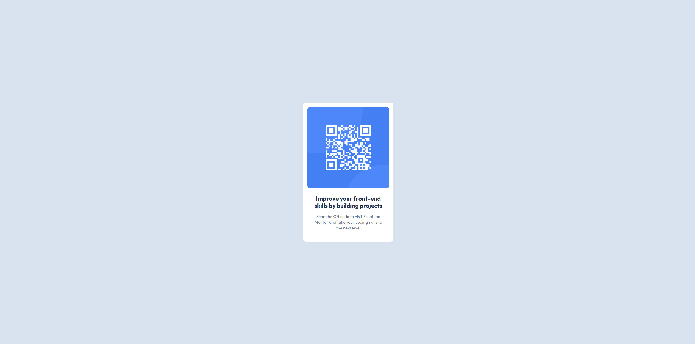

## Table of contents

- [Overview](#overview)
  - [Screenshot](#screenshot)
  - [Links](#links)
- [My process](#my-process)
  - [Built with](#built-with)
- [Author](#author)

## Overview

This project is a simple and elegant QR code component designed as part of a front-end challenge. The goal was to create a visually appealing card that displays a QR code along with a short, descriptive text, ensuring the design is fully responsive and adapts seamlessly to various screen sizes.

### Screenshot

### Links

- Live Site URL: (https://qr-code-three-gules.vercel.app/m)

## My process

Approach:
  To ensure the design was clean and responsive across all screen sizes, I used Flexbox for layout and alignment. Flexbox provided an efficient way to center the content both vertically and horizontally, making the card adaptable to various screen sizes without requiring absolute positioning or manual adjustments.

Why Flexbox?
  Flexbox is perfect for this project because:

  It simplifies the process of centering elements on the page.
  It allows dynamic resizing of the card and its content, ensuring responsiveness without complex calculations.
  It’s intuitive and requires minimal code compared to alternative methods like grid or absolute positioning.

### Built with

- Semantic HTML5 markup
- Flexbox

## Author

- Website - [Rodel Advincula](https://qr-code-three-gules.vercel.app/)

